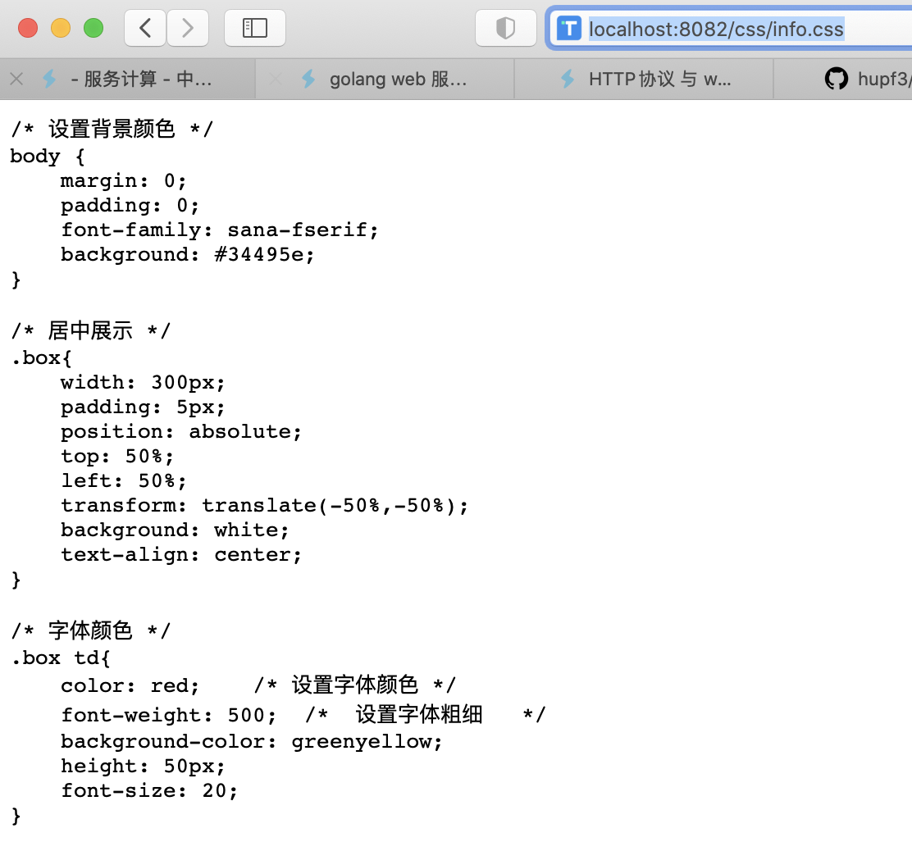

[toc]

# 开发 web 服务程序

## 概述

开发简单 web 服务程序 cloudgo，了解 web 服务器工作原理。

**任务目标**

1. 熟悉 go 服务器工作原理
2. 基于现有 web 库，编写一个简单 web 应用类似 cloudgo。
3. 使用 curl 工具访问 web 程序
4. 对 web 执行压力测试

## 任务要求

**基本要求**

1. 编程 web 服务程序 类似 cloudgo 应用。
   - 支持静态文件服务
   - 支持简单 js 访问
   - 提交表单，并输出一个表格（必须使用模板）
2. 使用 curl 测试，将测试结果写入 README.md
3. 使用 ab 测试，将测试结果写入 README.md。并解释重要参数。

**扩展要求**

选择以下一个或多个任务，以博客的形式提交。

1. 通过源码分析、解释一些关键功能实现
2. 选择简单的库，如 mux 等，通过源码分析、解释它是如何实现扩展的原理，包括一些 golang 程序设计技巧。

## Github 地址

[传送门](https://github.com/hupf3/cloudgo)

## 获取包

输入命令 

`go get github.com/hupf3/cloudgo/service`

或者在 `src` 对应的路径下输入以下命令

`git clone https://github.com/hupf3/cloudgo/service ` 

`go install`

## 设计文件结构

首先通过 `tree` 命令来查看一下文件的结构：


- `README.md`：库文件说明
- `assets`：静态文件根目录
  - `css`：包含了 `html` 文件的格式
  - `images`：`html` 文件用到的图片
  - `js`：为了验证简单的 `js` 访问
- `img`：`README.md` 需要用到的图片
- `main.go`：通过指定的端口进行监听 `http` 链接请求
- `service`：本文件夹存储了本次实现 `cloudgo` 的 `go` 文件
  - `apiTest.go`：输出了一个匿名结构 ，并 JSON序列化输出
  - `info.go`：信息表格的数据
  - `login.go`：登录界面数据请求
  - `serve.go`：初始化服务
- `templates`：存放 `html` 页面信息

## 任务要求实现

### 1.1 支持静态文件服务

获取静态资源的代码：

```go
// 静态文件
	mx.PathPrefix("/").Handler(http.FileServer(http.Dir(webRoot + "/assets/")))
```

本次实验的静态文件都存放到 `assets` 结构中：


在命令行输入 `go run main.go` 然后在指定的目录下就可以访问到不同的文件，进行查看信息

- `login.css`：关于登录页面的样式设置


- `info.css`：关于详细信息页面的样式设计



- `avatar.png`：头像图片


- `apitest.js`：验证 `js` 文件访问

  

### 1.2 支持简单 js 访问

此次访问访问的是国家省市等信息，具体实现的代码见 `apiTest.go` 文件：

```go
func apiTestHandler(formatter *render.Render) http.HandlerFunc {

	return func(w http.ResponseWriter, req *http.Request) {
		formatter.JSON(w, http.StatusOK, struct {
			Country  string
			Province string
			City     string
		}{Country: "中国", Province: "广东", City: "广州"})
	}
}
```

在 `serve.go` 中也需要进行初始化设置：

```go
// 测试
	mx.HandleFunc("/api/test", apiTestHandler(formatter)).Methods("GET")
```

写好的 `js` 文件如下所示：

```js
$(document).ready(function() {
    $.ajax({
        url: "/api/test"
    }).then(function(data) {
       $('.Country').append(data.Content);
       $('.Province').append(data.Province);
       $('.City').append(data.City);
    });
});
```

通过以上的代码，访问指定地址，即可实现简单的 `js` 访问，访问结果如下


### 1.3 提交表单，并输出一个表格

该过程需要实现两个页面，一个是提交表单的页面，一个是提交后显示的页面，所以也需要实现两个函数 `infoHandler` 和 `loginHandler` 。

我设计的过程是这样的通过输入登录的信息，这个过程相当于提交表单，然后在跳转出的页面输出刚刚输入的信息及其他信息到表格中。

```go
func loginHandler(formatter *render.Render) http.HandlerFunc {

	return func(w http.ResponseWriter, req *http.Request) {
		template := template.Must(template.New("login.html").ParseFiles("./templates/login.html"))
		_ = template.Execute(w, struct {
			Content string
		}{Content: "欢迎登录 CloudGo!"})
	}
}

func infoHandler(w http.ResponseWriter, r *http.Request) {
	r.ParseForm()
	username := template.HTMLEscapeString(r.Form.Get("username"))
	password := template.HTMLEscapeString(r.Form.Get("password"))
	t := template.Must(template.New("info.html").ParseFiles("./templates/info.html"))
	err := t.Execute(w, struct {
		Username string
		Password string
		ID       string
		School   string
		GPA      float32
	}{Username: username, Password: password, ID: "18342025", School: "中山大学", GPA: 4.2})
	if err != nil {
		panic(err)
	}
}

	// 登录
	mx.HandleFunc("/", loginHandler(formatter)).Methods("GET")

	// 信息列表
	mx.HandleFunc("/info", infoHandler).Methods("POST")
```

设计好 `go` 代码后，在相应的 `html` 文件中需要获取或者输入这些值：

```html
<body>
  <form class="box" action="./info" method="POST">
    <h1 class="content">{{.Content}}</h1>
    
    <input type="text" name="username" placeholder="请输入用户名">
    <input type="password" name="password" placeholder="请输入密码">
    <input type="submit" value="登录">
  </form>
</body>

<body>
    <table class="box" border="5" border-color="#99ccff">
        <tr>
            <td>Username</td>
            <td>{{.Username}}</td>
        </tr>
        <tr>
            <td>Password</td>
            <td>{{.Password}}</td>
        </tr>
        <tr>
            <td>ID</td>
            <td>{{.ID}}</td>
        </tr>
        <tr>
            <td>School</td>
            <td>{{.School}}</td>
        </tr>
        <tr>
            <td>GPA</td>
            <td>{{.GPA}}</td>
        </tr>
    </table>
</body>
```

为了让显示的效果更加好，我自行设计了 `css` 文件，主要设计了登录的界面的背景颜色，图片插入，输入框的动画显示(未选中和选中)，按钮的不同状态显示的样式不同(未选中和选中)，以及输出的表格的样式。具体的代码较长就不贴出，在 `assets/css` 目录下有，成果显示如下：


### 2. curl 测试

**curl 命令简单介绍**：

- `*` 表示 curl 任务；
- `>` 发送的信息;
- `<` 返回的信息

首先通过 `go run main.go` 跑起来服务器端代码，然后在命令行中输入

`curl -v http://localhost:8082`

结果如下所示：


可以看到成功显示出了登录页面 `html` 的设计

接下来测试不同的地址返回结果：


可以看到在 `cur` 测试的时候，go run 那也有信息的显示


### 3. ab 测试

ab 测试是压力测试程序

**用法**：ab [options] [http[s]://]hostname[:port]/path

**ab 测试参数的解释**：

-n 即requests，用于指定压力测试总共的执行次数。

-c 即concurrency，用于指定的并发数。

-t 即timelimit，等待响应的最大时间(单位：秒)。

-b 即windowsize，TCP发送/接收的缓冲大小(单位：字节)。

-p 即postfile，发送POST请求时需要上传的文件，此外还必须设置-T参数。

-u 即putfile，发送PUT请求时需要上传的文件，此外还必须设置-T参数。

-T 即content-type，用于设置Content-Type请求头信息，例如：application/x-www-form-urlencoded，默认值为text/plain。

-v 即verbosity，指定打印帮助信息的冗余级别。

-w 以HTML表格形式打印结果。

-i 使用HEAD请求代替GET请求。

-x 插入字符串作为table标签的属性。

-y 插入字符串作为tr标签的属性。

-z 插入字符串作为td标签的属性。

-C 添加cookie信息，例如：“Apache=1234”(可以重复该参数选项以添加多个)。

-H 添加任意的请求头，例如：“Accept-Encoding: gzip”，请求头将会添加在现有的多个请求头之后(可以重复该参数选项以添加多个)。

-A 添加一个基本的网络认证信息，用户名和密码之间用英文冒号隔开。

-P 添加一个基本的代理认证信息，用户名和密码之间用英文冒号隔开。

-X 指定使用的和端口号，例如:“126.10.10.3:88”。

-V 打印版本号并退出。

-k 使用HTTP的KeepAlive特性。

-d 不显示百分比。

-S 不显示预估和警告信息。

-g 输出结果信息到gnuplot格式的文件中。

-e 输出结果信息到CSV格式的文件中。

-r 指定接收到错误信息时不退出程序。

-h 显示用法信息，其实就是ab -help。

**结果参数**：

|         参数         |             含义             |
| :------------------: | :--------------------------: |
|    Docunment Path    |          请求的资源          |
|   Document Length    | 文档返回的长度，不包括相应头 |
| Time taken for tests |          总请求时间          |
|  Concurrency Level   |           并发个数           |
|  Complete requests   |           总请求数           |
|   Failed requests    |         失败的请求数         |
| Requests per second  |       平均每秒的请求数       |
|   Time per request   |    平均每个请求消耗的时间    |
|   Time per request   |   上面的请求时间除以并发数   |
|    Transfer rate     |           传输速率           |
|        50% 36        |    50%的请求在36Ms内完成     |

**测试结果**

了解了参数之后，开始进行 ab 测试:

- `ab -n 10000 http://localhost:8082/`


- `ab -n 1000 -c 100 http://localhost:8082/`

  

- `ab -n 1000 -c 100 http://localhost:8082/css/info.css`

  

- `ab -n 1000 -c 100 http://localhost:8082/js/apitest.js`

  

- `ab -n 1000 -c 100 http://localhost:8082/api/test`

  

## 附加要求博客地址

[传送门]()

